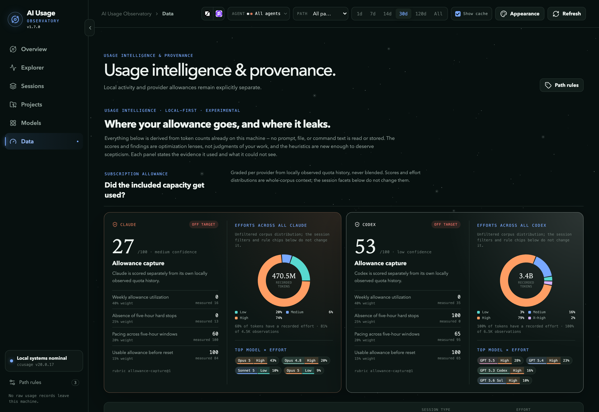
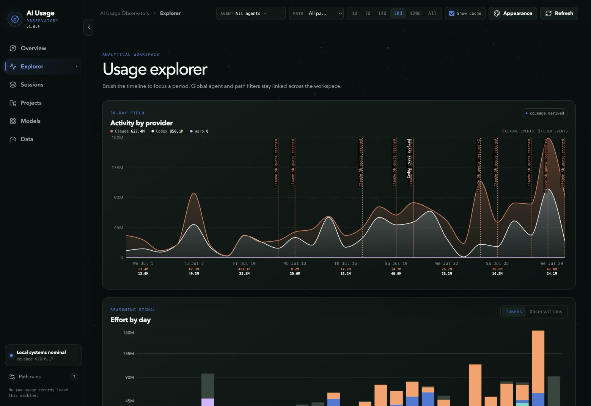
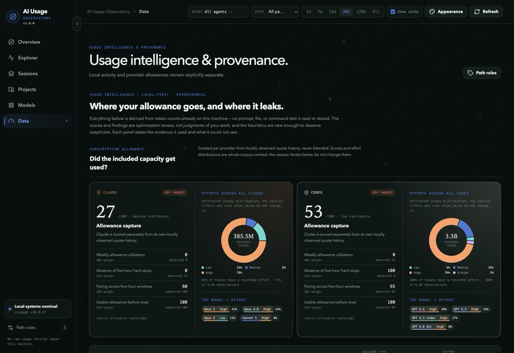
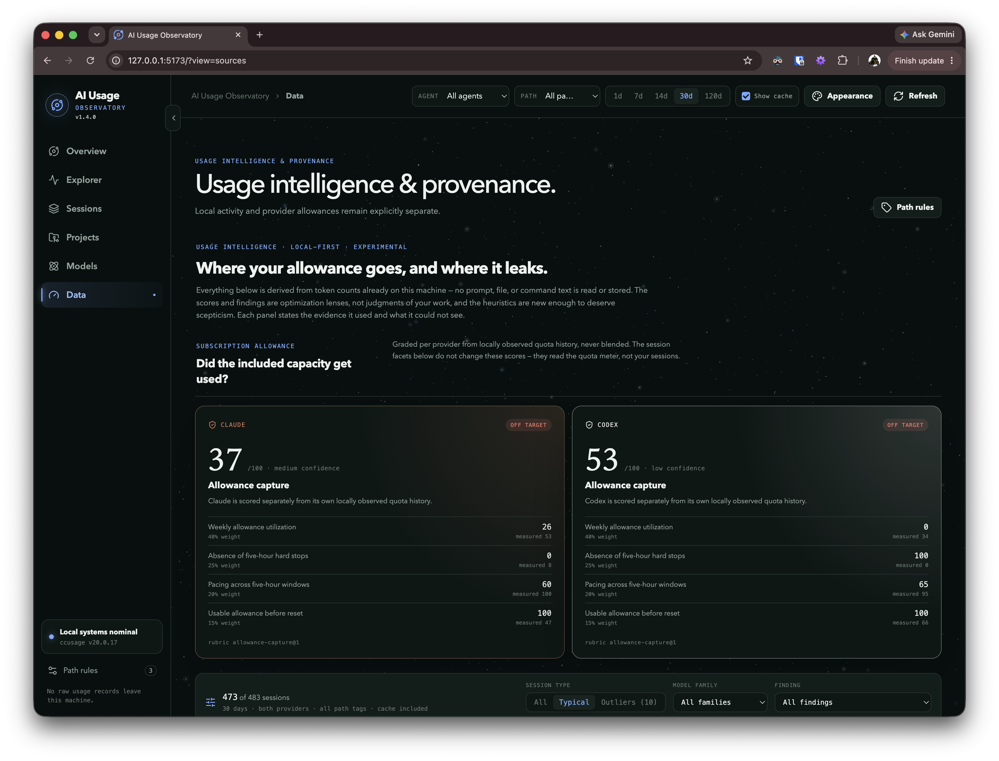

# Changelog

All notable changes to AI Usage Observatory are documented in this file.

The format is based on [Keep a Changelog](https://keepachangelog.com/en/1.1.0/),
and this project follows [Semantic Versioning](https://semver.org/spec/v2.0.0.html).

## [1.13.0] - 2026-08-16

### Added

- Add model x effort combo analysis, pairing each model family with the effort
  it recorded into a single comparable unit, with a combo board and day-stacked
  view reporting token and observation volume per combo.
- Report whole-session outcome metrics — API-equivalent cost, efficiency flags,
  and verdicts — only over sessions that a single combo uniquely led.
- Add session verdicts you record yourself, stored locally alongside existing
  tags and notes and surfaced once a cohort has enough ratings.
- Add per-model model x effort combo pills to Models, each showing its share of
  attributed tokens.

### Changed

- Present model x effort combos as the primary effort reading, keeping the
  aggregate effort stack and coverage as secondary context.
- Describe the new unit of comparison and the verdict data flow in the README
  and architecture documentation, and archive the completed plan documents.

### Fixed

- Prevent horizontal overscroll in Explorer. Cache-control tooltip text now
  wraps instead of widening the page, collapsed-sidebar tooltip styling is
  scoped to the sidebar, and global control labels, breadcrumbs, and button
  text condense at intermediate widths.

## [1.12.0] - 2026-08-14

### Added

- Add a per-model session control to the Projects view model mix. Each model in
  "Usage by model" opens a labeled card listing the sessions for that project and
  model, with the date range they span, the model's share of each session's tokens
  and API-equivalent cost, and a link to open the session.
- Page the project-and-model session list six sessions at a time, and dismiss the
  card with Escape, its close control, or a click outside it.

## [1.11.2] - 2026-08-14

### Added

- Add concise context labels and descriptions to pinnable chart tooltips across
  activity, project, model, and reasoning views.
- Add viewport-clamped tooltip descriptions with an explicit close control.

### Changed

- Persist the collapsed sidebar state and support hover-to-open navigation.
- Standardize daily tooltip date typography and keep project Tokens/API columns
  aligned with their existing headers.

### Fixed

- Prevent stale transient tooltips from surviving newer chart points or pinned
  cards.
- Keep contextual descriptions outside clipping containers and make pointer
  dismissal reliable alongside keyboard focus.

## [1.11.1] - 2026-08-13

### Fixed

- Stop a second tooltip from opening on the chart's first data point when a card
  is pinned. Focus moving to the pin handle no longer reaches the chart, whose
  accessibility layer read it as the start of keyboard navigation.

## [1.11.0] - 2026-08-13

### Added

- Add pinnable chart tooltips: a drag handle detaches a tooltip into a floating
  card that can be moved, stacked, and kept on screen while the chart keeps
  responding, with keyboard pinning, arrow-key movement, `Escape` to dismiss,
  viewport clamping, and automatic clearing on navigation or reload.

### Changed

- Keep chart tooltips reachable when the pointer leaves the plot area for the
  card, without delaying normal chart scrubbing.
- Standardize daily chart tooltip headers to abbreviated weekday, full month,
  and day, such as `Sun July 26`.

## [1.10.1] - 2026-08-10

### Changed

- Keep the ccusage audit renderer on the repository's Bun/TypeScript toolchain,
  removing the Python runtime requirement from project tooling.
- Refresh the Explorer screenshot and caption to include quota/reset context.

### Fixed

- Scope composition-bar layout styling to split-grid views so unrelated bars
  are not affected.

## [1.10.0] - 2026-08-09

### Added

- Add a custom inclusive date-to-date selector alongside the preset time ranges.

### Changed

- Apply the selected date range to Models, Projects, Overview sessions, and
  Data analysis, and expose the Cache filter in Overview.
- Clarify the README's usage analysis, visual-status playback, recommended
  `quota-service` setup, and compatible bring-your-own service contract.

### Fixed

- Keep usage, project, insight, effort, and quota-marker dates aligned to the
  system IANA timezone, and show the localized collection time.

## [1.9.0] - 2026-08-08

### Added

- Add model and agent text filtering, most- and least-used token ordering,
  full-width expanded model cards, dedicated collapse controls, and centered
  session pagination to Models.
- Add history-aware model session deep links and focused Models, Sessions, and
  Projects cards that yield to active user scrolling.
- Enrich expandable session details with bounded assistant-output samples,
  collapsible detail columns, mixed-model state, and per-file patch counts.
- Add compact local action menus for indexed session transcripts and changed
  files, with Finder, Visual Studio Code, and default text-editor targets.

### Changed

- Refresh the Overview, Sessions, and Projects README captures for v1.9.0, with
  the latest `gpt-5.6-sol` `ai-usage-observatory` session expanded and the
  `ai-usage-observatory` project focused.
- Require the recorded Codex and Claude release skills to update the README
  badges and changelog for every release.

### Fixed

- Keep automatic model, session, and project focus from overriding active user
  scrolling.

## [1.8.0] - 2026-08-05

### Added

- Add a direct-link copy action to session rows with copied feedback.

### Changed

- Match Artificial Analysis benchmark controls to their favicon backgrounds.
- Clarify README and release-capture guidance for framing Projects screenshots.

### Fixed

- Render provider activity series independently from a shared zero baseline so a
  zero-valued provider cannot trace another provider's activity.

## [1.7.0] - 2026-08-03

### Added

- Add Codex account credits to usage headroom surfaces.
- Add external benchmark comparison to Models.
- Add filter-aware empty states and contextual provider, model, and effort
  details across the workspace.

### Changed

- Normalize usage, project, and effort date grouping to UTC.
- Refine Agent filter summaries, headroom visualization, chart rendering,
  project details, and appearance change feedback.
- Refresh the README screenshot gallery, including an expanded
  `ai-usage-observatory` Projects capture.
- Document the single-account-per-provider assumption.

### Fixed

- Stabilize the Agent selector popover.
- Prevent filtered views from presenting misleading empty totals or charts.

### Screenshots

## [1.6.0] - 2026-07-29

### Added

- Add an All Time range to the dashboard filters and collect the full available
  local ccusage history when refreshing data.
- Add timestamps to recent user prompts in session detail and allow switching
  between oldest-first and newest-first ordering.
- Add opt-in provider-recorded reasoning-effort information to Dashboard,
  Explorer, Sessions, Projects, Models, and Data, including Unknown/Mixed
  states, scoped coverage, raw breakdowns, and local privacy controls.
- Add an incremental, resumable transcript-derived effort index with bounded
  parsing, source reconciliation, parser quality counters, and derived-data
  deletion.
- Add a cascading Agent filter for selecting complete providers or individual
  model families consistently across the workspace.
- Add per-provider effort distributions and top model-by-effort combinations to
  the Data allowance profiles.

### Changed

- Refresh the public README badges, visual-status preview, and current Explorer
  and Data screenshots.
- Use one provider mapper across collection, insights, and effort analysis,
  including `openai`-flavoured Codex agent labels.
- Refine the Data findings interface with model-and-effort badges, bounded
  model/project breakdowns, and removal of the redundant supporting-sessions
  card.
- Keep the usage-intelligence interface explicitly experimental and likely to
  change. Comments and suggestions are welcome: open an Issue or just comment
  on the release.

### Fixed

- Correct overcounting discovered in transcript-derived reasoning-effort totals
  by excluding replayed fork history and repeated Codex token events, so
  derived totals reconcile with pinned ccusage session totals.
- Correct the Data facet-row alignment and preserve usable scrolling for long
  effort breakdowns.

### Screenshots

## [1.5.0] - 2026-07-26

### Added

- Rebuild the Sources view around provider-specific allowance intelligence,
  including graded capture profiles, quota signals, efficiency measures, usage
  outliers, and session facets.
- Add a deterministic, tab-free Data screenshot capture and release archiving
  command.

### Changed

- Refresh the README Data screenshot and preserve its reviewed v1.5.0 copy in
  the changelog.

### Fixed

- Balance the subscription-allowance explanation text without changing other
  section descriptions.

### Screenshots

## [1.4.0] - 2026-07-25

### Added

- Surface Anthropic usage credits, prepaid balance, and credit provenance from
  quota-service across the Overview and Sources views (usage-credit spend,
  prepaid balance, and a grouped Fable transition credit; money formatted per
  each object's currency).
- Add a Claude Web credit import workflow: a localhost-proxied modal, launchable
  from the Overview card and Sources, that updates the imported credit snapshot
  and refreshes the dashboard on success. It never handles browser credentials,
  and a rejected import leaves prior data intact.
- Expand the Sources quota card into three evidence groups — live provider API,
  imported Claude Web credits (with the 403 boundary and support links), and
  local quota history — each with bounded, scrollable raw evidence.
- Track imported-credit freshness (aging at 24h, stale at 7d) independently of
  live provider freshness.

### Removed

- Remove the unused Personal Budget card and its month/target computations from
  the Sources view. The stored monthlyBudget setting is retained so the panel
  can be reinstated later without data loss.

## [1.3.0] - 2026-07-25

### Added

- Add a Tesseract core scene effect (Appearance, on by default, toggleable)
  that replaces the telescope icon with a 4D hypercube at the sphere's center,
  contorting through its 4D rotations as the scene is dragged or auto-rotates.
- Restyle the sidebar collapse toggle as a border tab and add a version label.

### Fixed

- Stop the navigation icon from flex-shrinking, which collapsed the active
  item's icon to zero width in the collapsed sidebar (its dot indicator
  consumed the remaining row space) and undersized the others.
- Center the local-status dot and keep the Path rules icon full size and
  centered in the collapsed sidebar instead of shrinking and left-biasing them.
- Keep the active navigation item's icon and label legible with dark accent
  colors by lifting the active color toward the foreground instead of using
  the raw accent, which turned dark on the dark sidebar.
- Use live ccusage pricing instead of the bundled offline table, and surface
  unpriced models with a global banner, per-model indicators, and a degraded
  source-health status so cost gaps are visible rather than silently zero. This
  fixes the missing Opus 5 API-equivalent cost, which the offline table lacked
  and previously counted as zero.
- Separate latest-session row actions on the Overview.
- Stop sidebar icons shifting on collapse by fading labels instead of snapping.

## [1.2.0] - 2026-07-21

### Added

- Add a Show cache control to include or exclude cache reads and writes from
  applicable usage totals, charts, and model breakdowns.

### Changed

- Group Explorer token composition into direct-token and cache-traffic sections.
- Improve the README, including a linked screenshot gallery marked as v1.0.0
  screens.
- Rename the project-detail “Records” label to “Runs.”

## [1.1.0] - 2026-07-21

### Added

- Show recorded quota-reset usage details and provider quota events on activity
  timelines.
- Add a reviewed repository release workflow for Codex and Claude Code with
  explicit approval gates.

### Changed

- Rename the Limits & sources view to Sources while preserving legacy links.
- Add provider token totals beneath activity dates, clarify project chart
  labels and layout, and segment project token bars by provider.

### Fixed

- Keep quota-event labels legible when multiple markers share a timestamp.

## [1.0.0] - 2026-07-20

### Added

- Add Overview, Explorer, Sessions, Projects, Models, and data-provenance views
  for local AI coding usage.
- Ingest daily, weekly, monthly, session, project-instance, and five-hour-block
  analytics from pinned `ccusage@20.0.17` data.
- Show token composition, API-equivalent cost, model mix, provider activity,
  project attribution, and session drilldowns.
- Add linked date, provider, and derived-path filters with retroactive glob and
  regular-expression path rules.
- Index Claude Code and Codex session metadata for project paths without storing
  prompt or response content.
- Support manual session tags and notes.
- Integrate optional, read-only provider allowance data from `quota-service`,
  including allowance windows, reset credits, and source health.
- Add configurable appearance controls, reduced-motion support, and an
  interactive Observatory scene.

### Changed

- Optimize dashboard refreshes and session-detail loading while retaining the
  last successful data snapshot when a refresh fails.

### Fixed

- Correct path- and date-filtered totals, session extraction, navigation and
  modal behavior, project controls, and accessibility focus states.

[1.13.0]: https://github.com/anobjectn/ai-usage-observatory/compare/v1.12.0...v1.13.0
[1.12.0]: https://github.com/anobjectn/ai-usage-observatory/compare/v1.11.2...v1.12.0
[1.11.2]: https://github.com/anobjectn/ai-usage-observatory/compare/v1.11.1...v1.11.2
[1.11.1]: https://github.com/anobjectn/ai-usage-observatory/compare/v1.11.0...v1.11.1
[1.11.0]: https://github.com/anobjectn/ai-usage-observatory/compare/v1.10.1...v1.11.0
[1.10.1]: https://github.com/anobjectn/ai-usage-observatory/compare/v1.10.0...v1.10.1
[1.10.0]: https://github.com/anobjectn/ai-usage-observatory/compare/v1.9.0...v1.10.0
[1.9.0]: https://github.com/anobjectn/ai-usage-observatory/compare/v1.8.0...v1.9.0
[1.8.0]: https://github.com/anobjectn/ai-usage-observatory/compare/v1.7.0...v1.8.0
[1.7.0]: https://github.com/anobjectn/ai-usage-observatory/compare/v1.6.0...v1.7.0
[1.6.0]: https://github.com/anobjectn/ai-usage-observatory/compare/v1.5.0...v1.6.0
[1.5.0]: https://github.com/anobjectn/ai-usage-observatory/compare/v1.4.0...v1.5.0
[1.4.0]: https://github.com/anobjectn/ai-usage-observatory/compare/v1.3.0...v1.4.0
[1.3.0]: https://github.com/anobjectn/ai-usage-observatory/compare/v1.2.0...v1.3.0
[1.2.0]: https://github.com/anobjectn/ai-usage-observatory/compare/v1.1.0...v1.2.0
[1.1.0]: https://github.com/anobjectn/ai-usage-observatory/compare/v1.0.0...v1.1.0
[1.0.0]: https://github.com/anobjectn/ai-usage-observatory/releases/tag/v1.0.0
