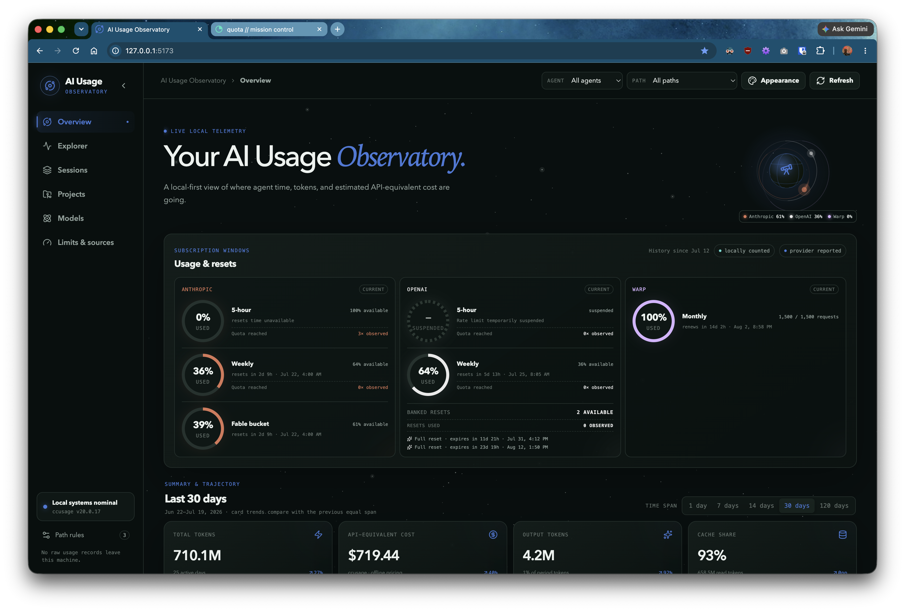
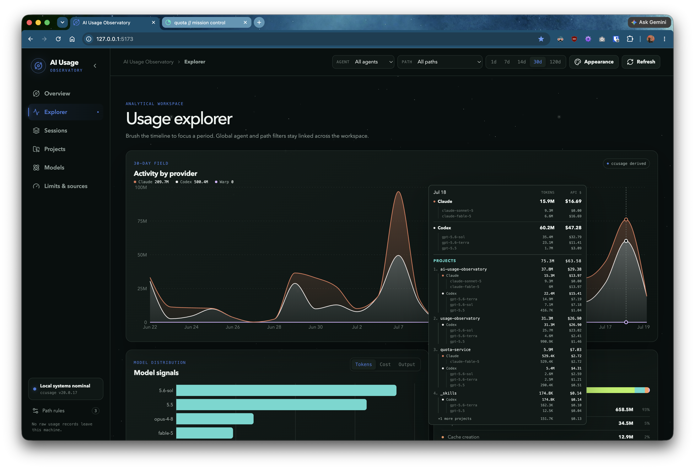
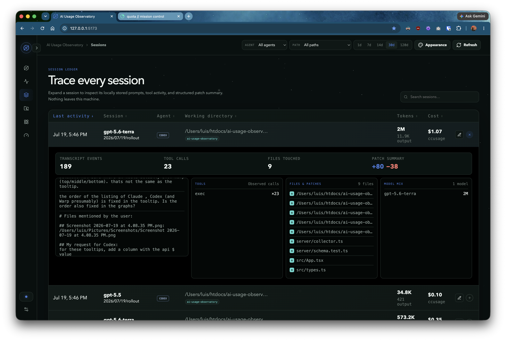
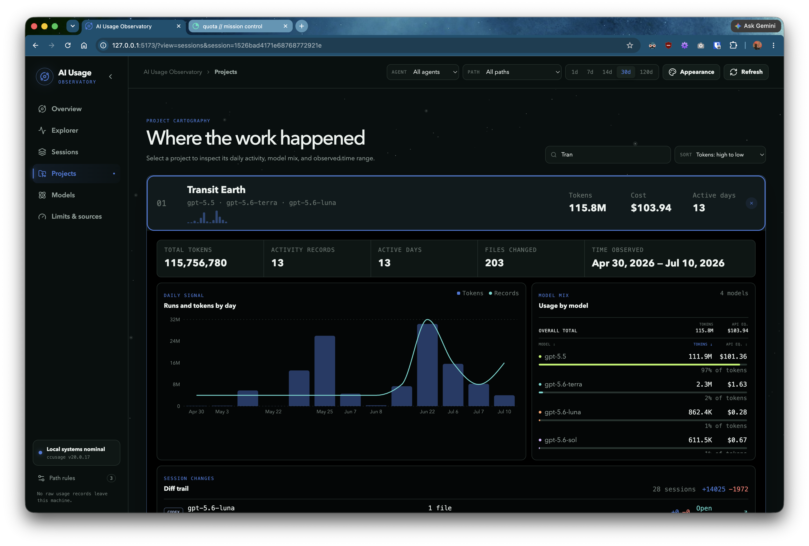
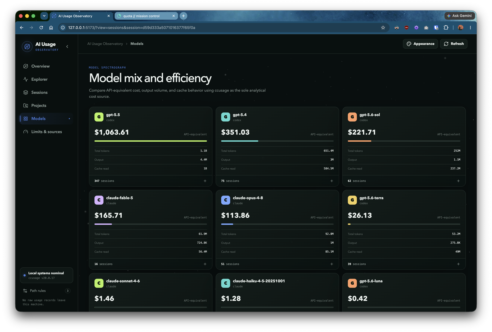
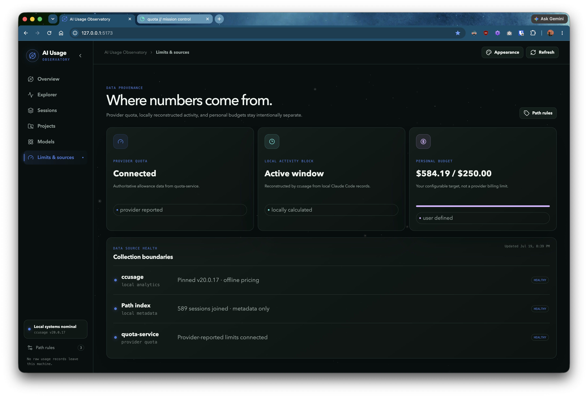
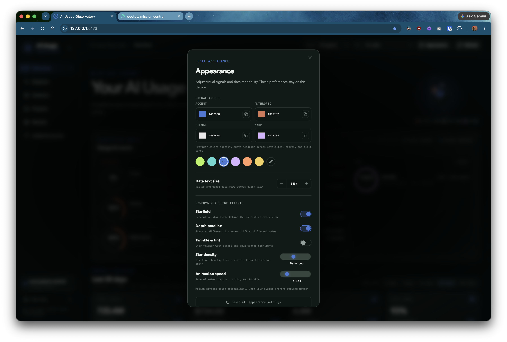

# AI Usage Observatory

A local-first mission control for understanding AI coding usage. It combines pinned `ccusage` analytics, metadata-only working-directory indexing, and optional provider quota data from [`quota-service`](https://github.com/anobjectn/quota-service).

## Screenshots















## Start

Requirements: Bun 1.3 or newer.

```bash
bun install
bun run dev
```

Open `http://127.0.0.1:5173`.

For a production build:

```bash
bun run build
bun run start
```

Open `http://127.0.0.1:4318`.

## What ships in this first release

- Overview, Explorer, Sessions, Projects, Models, and Limits/source-health views.
- Daily, weekly, monthly, session, project-instance, and five-hour-block ingestion from pinned `ccusage@20.0.17`.
- Token composition and ccusage-sourced API-equivalent cost.
- Linked date, agent, and derived path filters.
- Tier 1 working-directory index for Claude Code and Codex session records.
- Daily cross-provider project attribution from session working directories, with per-model token constituents.
- Glob and regex path rules, evaluated retroactively.
- Manual session tags and notes.
- Optional read-only [`quota-service`](https://github.com/anobjectn/quota-service) integration at `http://127.0.0.1:8787`.
- Startup, 60-second, and manual refresh with last-success retention.
- A semantic dark Observatory theme with reduced-motion support.

## Data and privacy

The application binds to localhost and makes no analytics calls. `ccusage` runs in offline-pricing mode. The path indexer reads only the beginning of local session files to extract native session ID and working directory; it stores no prompt or response content. Application state is written to `.usage-observatory/data.db`, which is ignored by Git.

Set `USAGE_OBSERVATORY_DB` to use another database path. Set `QUOTA_SERVICE_URL` to point at a different [`quota-service`](https://github.com/anobjectn/quota-service) instance.

## Information sources and credit

- [ccusage](https://github.com/ccusage/ccusage) v20.0.17 by ryoppippi (MIT) provides the local usage analytics and offline API-equivalent price estimates.
- Local Claude Code and Codex session-file headers provide session identifiers and working-directory metadata. Prompt and response content is not stored.
- [`quota-service`](https://github.com/anobjectn/quota-service) optionally provides provider-reported allowance windows, resets, and status. It is a separate localhost service, not a bundled dependency.

## Methodology boundaries

- Historical cost: `ccusage` only.
- Provider allowance: optional [`quota-service`](https://github.com/anobjectn/quota-service), visibly labeled provider-reported.
- Five-hour block: locally reconstructed by `ccusage`; currently Claude Code-scoped.
- Personal budget: user-defined and not a billing limit.


### Use your own quota service instead of [`quota-service`](https://github.com/anobjectn/quota-service) or leave it out

Without [`quota-service`](https://github.com/anobjectn/quota-service), the dashboard continues to show ccusage-derived tokens, costs, sessions, projects, and local activity blocks. Provider allowance cards remain unavailable rather than estimating subscription quota from token usage. This project does not include a direct provider collector.

Set `QUOTA_SERVICE_URL` to the base URL of a replacement service. AI Usage Observatory reads it only; it makes concurrent `GET` requests to `/usage`, `/resets`, and `/status`, with a four-second timeout per request. Each endpoint must return a successful JSON response for the quota source to be available. `/status` is retained for source-health reporting and may return any JSON value.

`/usage` must return an object with `generatedAt` (a number) and `providers` (an array). Each provider has a `provider` value of `anthropic`, `codex`, or `warp`; a `status` of `ok`, `stale`, `unavailable`, or `unknown`; a nullable `source`; and a nullable `snapshot`. `error` is optional. A window snapshot supports Anthropic and Codex allowance windows; a pool snapshot supports Warp-style request pools:

```json
{
  "generatedAt": 1763894400000,
  "providers": [
    {
      "provider": "anthropic",
      "status": "ok",
      "source": "my-collector",
      "snapshot": {
        "kind": "window",
        "fiveHour": { "usedPercent": 36, "resetsAt": 1763912400000 },
        "weekly": { "usedPercent": 12, "resetsAt": 1764499200000 },
        "modelWindows": {
          "example-model": { "usedPercent": 18, "resetsAt": 1763912400000 }
        }
      }
    },
    {
      "provider": "warp",
      "status": "ok",
      "source": "my-collector",
      "snapshot": {
        "kind": "pool",
        "pool": {
          "used": 42,
          "limit": 100,
          "usedPercent": 42,
          "refreshesAt": 1767225600000,
          "cadence": "Monthly"
        }
      }
    }
  ]
}
```

Window fields `fiveHour` and `weekly` may be `null`; `modelWindows` is optional. Every window uses a numeric `usedPercent` and a Unix-millisecond `resetsAt` (or `null`). A pool uses numeric `used`, `limit`, and `usedPercent`, a Unix-millisecond `refreshesAt` (or `null`), and an optional `cadence` label.

`/resets` may return an empty object when you do not provide banked Codex reset credits. When provided, use this shape:

```json
{
  "codexBankedResetCredits": {
    "availableCount": 1,
    "totalEarnedCount": 3,
    "status": "ok",
    "credits": [
      {
        "id": "credit-123",
        "title": "Extra reset",
        "status": "available",
        "expiresAt": "2026-12-31T00:00:00.000Z"
      }
    ]
  }
}
```

The dashboard uses `available` credits for the visible banked-reset list. It does not require a particular `status` string for individual credits, and `expiresAt` may be `null`.

The optional local history summary (observed quota reaches and consumed reset credits) is specific to quota-service's SQLite database. For each 5-hour and weekly allowance, it retains the first local observation for every full quota cycle and lists all observed-at-limit times alongside the total. It is not part of the HTTP replacement contract. It remains unavailable for another service unless it also provides a compatible database through `QUOTA_DB_PATH`.

## Verification

```bash
bun run typecheck
bun test
bun run build
```

## Deferred from the larger plan

The first release intentionally defers additional theme packs, wallpaper engines, git-aware worktree canonicalization, touched-file indexing, task classification, filesystem watching, a desktop wrapper, and native provider collectors.
