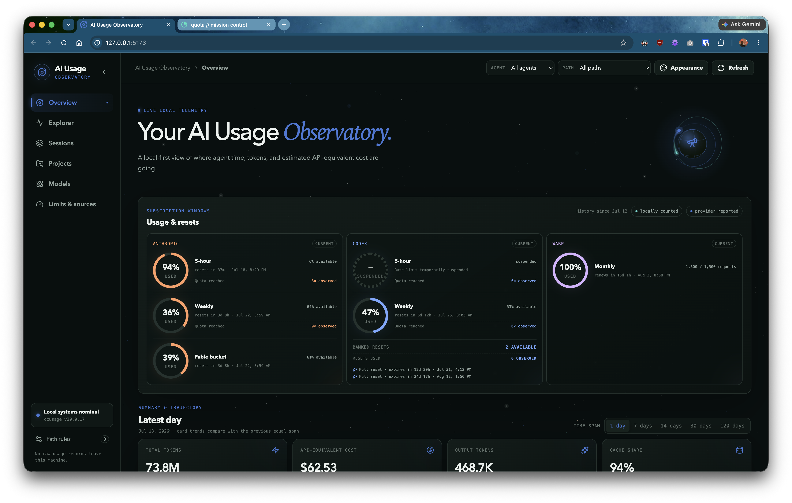
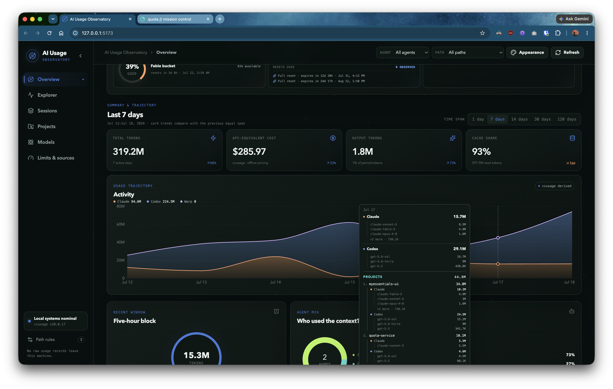
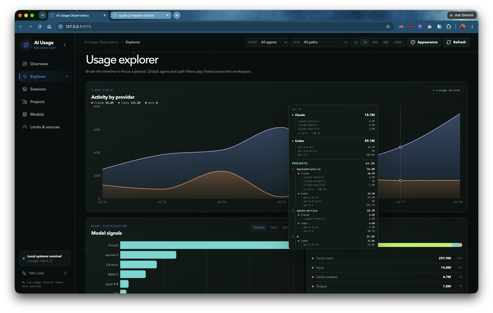
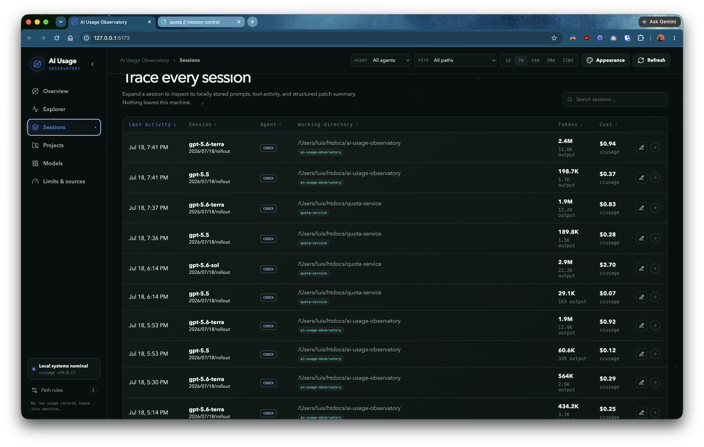
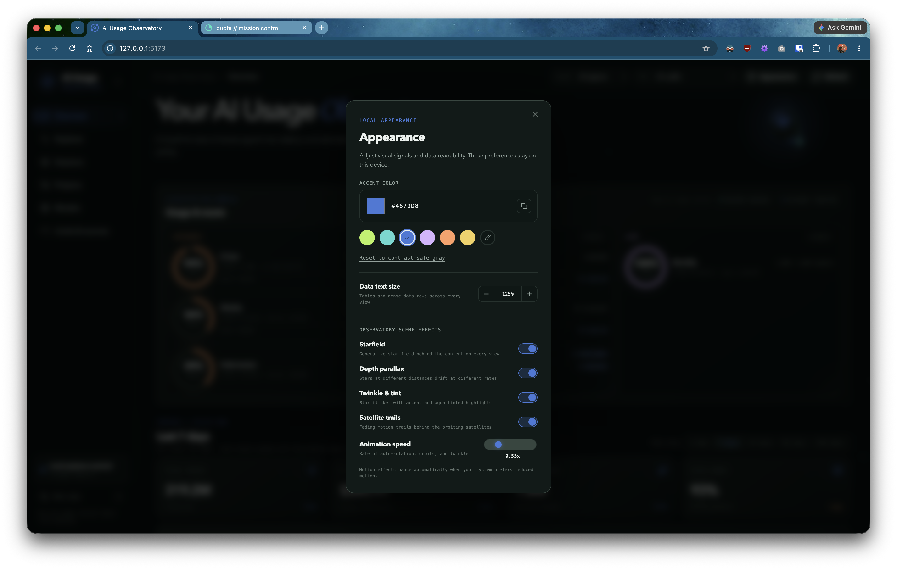

# AI Usage Observatory

A local-first mission control for understanding AI coding usage. It combines pinned `ccusage` analytics, metadata-only working-directory indexing, and optional provider quota data from [`quota-service`](https://github.com/anobjectn/quota-service).

## Screenshots











## Start

Requirements: Bun 1.3 or newer.

```bash
bun install
bun run dev
```

Open `http://127.0.0.1:5173`.

For a production build:

```bash
bun run build
bun run start
```

Open `http://127.0.0.1:4318`.

## What ships in this first release

- Overview, Explorer, Sessions, Projects, Models, and Limits/source-health views.
- Daily, weekly, monthly, session, project-instance, and five-hour-block ingestion from pinned `ccusage@20.0.17`.
- Token composition and ccusage-sourced API-equivalent cost.
- Linked date, agent, and derived path filters.
- Tier 1 working-directory index for Claude Code and Codex session records.
- Daily cross-provider project attribution from session working directories, with per-model token constituents.
- Glob and regex path rules, evaluated retroactively.
- Manual session tags and notes.
- Optional read-only [`quota-service`](https://github.com/anobjectn/quota-service) integration at `http://127.0.0.1:8787`.
- Startup, 60-second, and manual refresh with last-success retention.
- A semantic dark Observatory theme with reduced-motion support.

## Data and privacy

The application binds to localhost and makes no analytics calls. `ccusage` runs in offline-pricing mode. The path indexer reads only the beginning of local session files to extract native session ID and working directory; it stores no prompt or response content. Application state is written to `.usage-observatory/data.db`, which is ignored by Git.

Set `USAGE_OBSERVATORY_DB` to use another database path. Set `QUOTA_SERVICE_URL` to point at a different [`quota-service`](https://github.com/anobjectn/quota-service) instance.

## Information sources and credit

- [ccusage](https://github.com/ccusage/ccusage) v20.0.17 by ryoppippi (MIT) provides the local usage analytics and offline API-equivalent price estimates.
- Local Claude Code and Codex session-file headers provide session identifiers and working-directory metadata. Prompt and response content is not stored.
- [`quota-service`](https://github.com/anobjectn/quota-service) optionally provides provider-reported allowance windows, resets, and status. It is a separate localhost service, not a bundled dependency.

## Methodology boundaries

- Historical cost: `ccusage` only.
- Provider allowance: optional [`quota-service`](https://github.com/anobjectn/quota-service), visibly labeled provider-reported.
- Five-hour block: locally reconstructed by `ccusage`; currently Claude Code-scoped.
- Personal budget: user-defined and not a billing limit.

## Quota-service fallback

Without [`quota-service`](https://github.com/anobjectn/quota-service), the dashboard continues to show ccusage-derived tokens, costs, sessions, projects, and local activity blocks. Provider allowance cards remain unavailable rather than estimating subscription quota from token usage. To restore provider allowance data, configure `QUOTA_SERVICE_URL` to a compatible service exposing `/usage`, `/resets`, and `/status`; this project does not include a direct provider collector.

## Verification

```bash
bun run typecheck
bun test
bun run build
```

## Deferred from the larger plan

The first release intentionally defers additional theme packs, wallpaper engines, git-aware worktree canonicalization, touched-file indexing, task classification, filesystem watching, a desktop wrapper, and native provider collectors.
