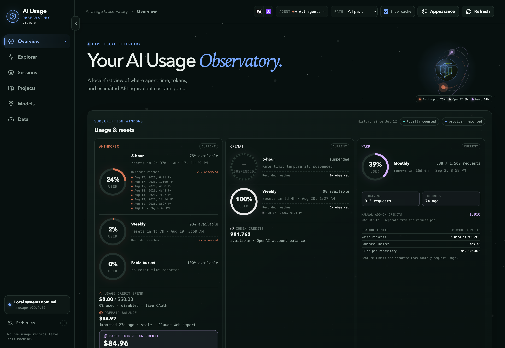
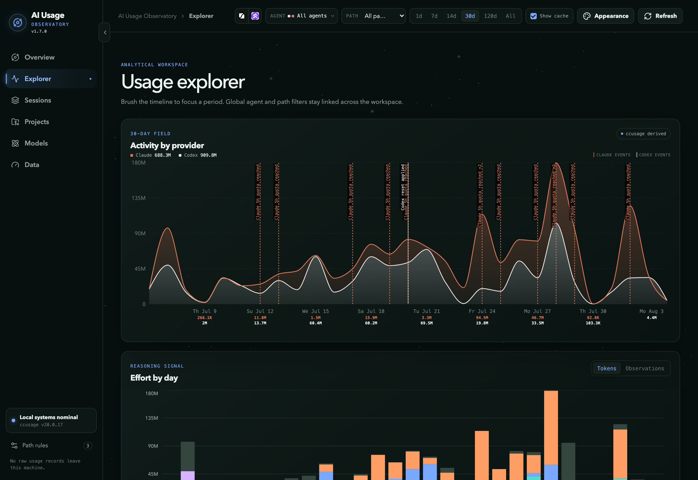
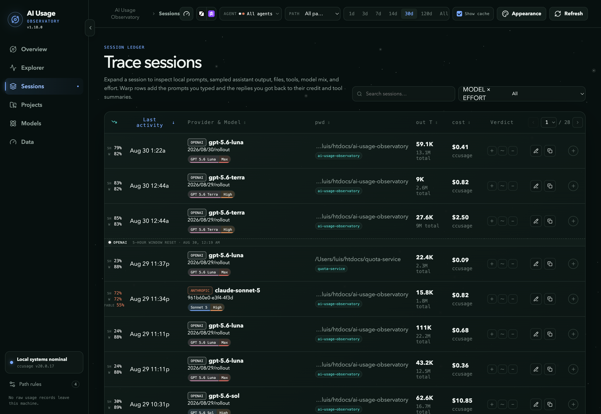
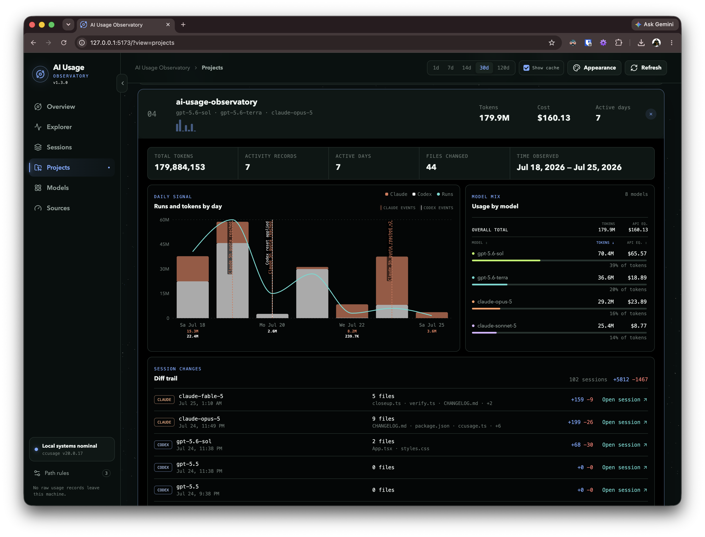
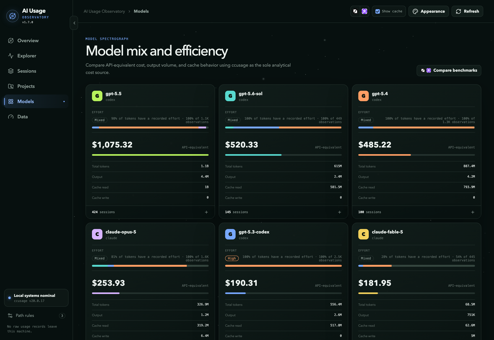
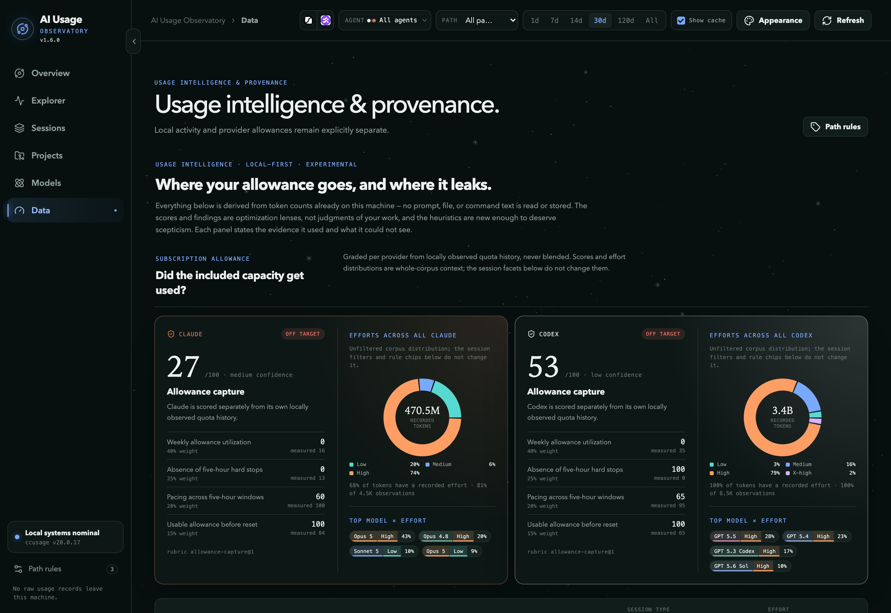
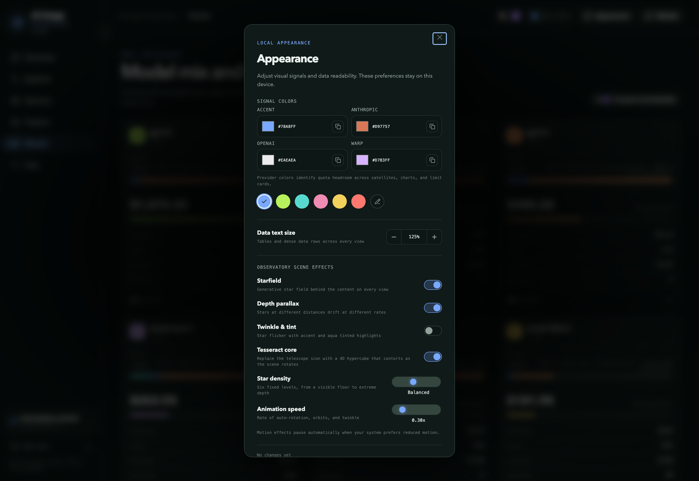
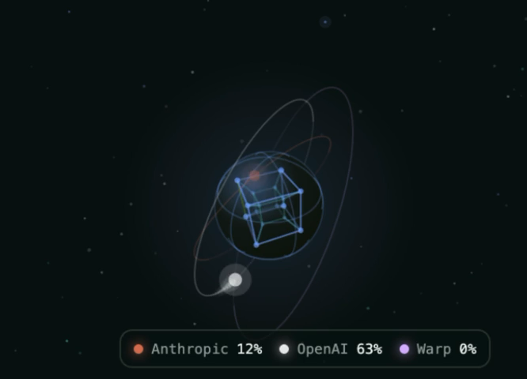

# AI Usage Observatory


AI Usage Observatory is a local-first analytics workspace for people who want to
understand and improve how they use AI coding agents.

Provider dashboards can show how much capacity remains. The Observatory connects
that usage to the work behind it: projects, sessions, models, token composition,
reasoning effort, and changes over time. It creates a practical feedback loop for
measuring current habits, investigating changes or outliers, and making more
informed decisions about model choice, effort, and workflow.

The analysis runs on your machine against data already stored there. No separate
cloud account or telemetry service is required.

## Questions the Observatory helps answer

| Question | Evidence available |
| --- | --- |
| How is my usage changing? | Daily, weekly, monthly, per-session, and five-hour activity, with comparable date ranges. |
| Which work is driving it? | Cross-provider attribution to projects and sessions, including model breakdowns. |
| How are model and effort choices shifting? | Token composition, API-equivalent cost, model mix, and provider-recorded reasoning effort where available. |
| How much provider capacity remains? | Optional provider-reported allowance windows, headroom, resets, credits, and locally observed quota history. |
| Which activity deserves closer review? | Outlier sessions, allowance-capture and efficiency signals, transcript context, tool activity, and patch summaries. |

The Observatory does not treat higher or lower usage as inherently better. It
provides a consistent record so you can establish a baseline, change how you
work, and evaluate the result over time.

## Run locally

Requires Bun 1.3 or newer.

```bash
bun install
bun run dev
```

Open `http://127.0.0.1:5173`.

For a production build:

```bash
bun run build
bun run start
```

Open `http://127.0.0.1:4318`.

## Inside the Observatory

Click any screenshot to open it at full size. The gallery reflects the current
application; release changelogs preserve version-specific captures.

<a href="docs/screenshots/1.dashboard.png">
  
</a>

<sub>Overview — provider allowance, headroom, reset timing, and usage trajectory</sub>

<table>
  <tr>
    <td width="50%">
      <a href="docs/screenshots/2.explorer.png">
        
      </a>
      <sub>Explorer — activity over time and model distribution</sub>
    </td>
    <td width="50%">
      <a href="docs/screenshots/3.sessions.png">
        
      </a>
      <sub>Sessions — transcript context, tool activity, and patch detail</sub>
    </td>
  </tr>
  <tr>
    <td width="50%">
      <a href="docs/screenshots/4.projects.png">
        
      </a>
      <sub>Projects — daily activity, model mix, and change trail</sub>
    </td>
    <td width="50%">
      <a href="docs/screenshots/5.models.png">
        
      </a>
      <sub>Models — usage, cost, output, cache behavior, and effort</sub>
    </td>
  </tr>
  <tr>
    <td width="50%">
      <a href="docs/screenshots/6.data-intelligence.png">
        
      </a>
      <sub>Data — allowance intelligence, usage findings, and provenance</sub>
    </td>
    <td width="50%">
      <a href="docs/screenshots/7.appearance.png">
        
      </a>
      <sub>Appearance — signal colors, text size, and scene effects</sub>
    </td>
  </tr>
</table>



<sub>Visual status — a still from the provider-headroom animation</sub>

[Download the 18-second visual-status recording (MP4)](docs/screenshots/AIUO-visual-status.mp4).
GitHub serves this repository-tracked MP4 as a download rather than an inline
player, so the README uses an explicitly labeled still preview.

<details>
<summary>Maintaining the screenshot gallery</summary>

To refresh the Data screenshot without a personal Chrome profile or existing
browser tabs, run `bun run screenshot:data`. The command captures the Data view
at a fixed 1558 × 1072 CSS-pixel viewport.

Before a release, preserve the reviewed image with
`bun run screenshot:archive -- vX.Y.Z`. The changelog must reference that
archived copy rather than the rolling README image.

For Projects captures, open `ai-usage-observatory` and scroll it into view so
`myessentials-ui` and `PEF-Main-WP` remain outside the screenshot frame.

</details>

## Designed for ongoing analysis

Six connected views — Overview, Explorer, Sessions, Projects, Models, and Data —
use the same collected dataset. Date, agent, path, and cache controls carry
analytical context between the views that support each filter.

- Track usage daily, weekly, monthly, by session, by project instance, and by
  reconstructed five-hour block with pinned `ccusage@20.0.17`.
- Separate input, output, cache-read, and cache-creation tokens, or exclude cache
  traffic when it would obscure the comparison.
- Compare API-equivalent cost, model mix, and provider-recorded reasoning effort
  without presenting missing effort labels as known data.
- Trace work across Claude Code and Codex from session to project and model.
- Apply glob or regular-expression path rules retroactively to the indexed
  history.
- Add durable session tags and notes to preserve your own analytical context.
- Review allowance capture, efficiency signals, and outlier sessions in the
  experimental Data analysis.
- Refresh on startup, every 60 seconds, or on demand; if collection fails, the
  last successful result remains available and is marked stale.

## How the data is assembled

| Signal | Source | Role |
| --- | --- | --- |
| Tokens and API-equivalent cost | Pinned [`ccusage`](https://github.com/ccusage/ccusage) analytics | Produces usage rollups and reconstructed activity blocks from local records. |
| Session and project attribution | Local Claude Code and Codex session files | Recovers native session identifiers and working directories through a metadata-only path index. |
| Reasoning effort | Optional derived index of local session files | Reads provider-recorded effort labels and stores categorical aggregates, never reasoning text. |
| Provider capacity | Optional [`quota-service`](https://github.com/anobjectn/quota-service) instance | Supplies provider-reported allowance windows, resets, credits, and status without changing local usage totals. |

> [!IMPORTANT]
> The current data model assumes one Claude Code account and one Codex account
> per machine. If you switch accounts within a provider, their local activity is
> combined rather than attributed separately. See
> [Measurement boundaries](#measurement-boundaries).

## Privacy model

Usage records, derived indexes, annotations, and application state remain on the
machine running the Observatory. The server binds to localhost, sends no
telemetry, and does not upload prompts, responses, or usage records. `ccusage`
may retrieve current pricing data; that request does not contain your usage
records.

The default path index is metadata-only. It reads only the opening bytes of each
session file — enough to recover the native session ID and working directory.

Reasoning-effort indexing is separate, opt-in, and disabled by default. When
enabled in Data, it scans transcripts incrementally and stores only
session/date/provider/model/effort categories, token buckets, observation
counts, parser offsets and hashes, and quality counters. It never stores
prompts, responses, reasoning text, commands, tool arguments or results, file
contents, or transcript fragments. Disabling the index stops new processing and
excludes retained rows from analysis; Data can delete all derived effort
observations without touching transcripts, annotations, or `ccusage` snapshots.

Session detail is the one place where your own prompts and sampled assistant
output appear. When you open a session, the server reads its file on demand and
returns recent user prompts plus bounded assistant-visible text samples so you
can identify the work. Reasoning, tool arguments, and tool results are excluded.
The response is sent only to your localhost browser and is not stored in the
database. The server does not retain the transcript read after serving it.

Session-detail action menus can reveal a transcript or listed changed file in
Finder, open it in Visual Studio Code, or send it to the macOS default text
editor. Each action requires an explicit click. The server resolves the target
from its indexed session record and never executes a browser-supplied shell
command.

Application state is stored in `.usage-observatory/data.db`, which Git ignores.
Set `USAGE_OBSERVATORY_DB` to move the database. Set `QUOTA_SERVICE_URL` to use a
different quota-service base URL.

## Measurement boundaries

- Local activity and provider-reported allowance percentages are separate
  evidence sources. They are presented together for context, not treated as
  values that should reconcile one-for-one.
- Every figure assumes one account per provider. Session indexing reads one
  local Claude Code session tree and one local Codex session tree;
  [`quota-service`](https://github.com/anobjectn/quota-service) reads one signed-in
  credential per provider — the macOS Keychain item written by Claude Code and
  `~/.codex/auth.json`. Activity from multiple accounts on the same provider is
  displayed as one combined stream.
- Historical cost comes exclusively from `ccusage`. It is an API-equivalent
  estimate, not a subscription bill. Models without a current rate card are
  identified in the interface and excluded from cost totals rather than counted
  as free.
- Allowance figures come from the optional
  [`quota-service`](https://github.com/anobjectn/quota-service) and are labeled as
  provider-reported in the interface.
- Five-hour blocks are reconstructed locally by `ccusage` and currently cover
  Claude Code only.
- Effort labels are shown as recorded after trimming and lowercasing. They are
  not inferred from model names or reasoning-token counts, and they are not a
  quality score or recommendation. One observation represents one Claude
  assistant usage event or one Codex turn context.

## Provider allowance data

The Observatory is useful with or without live quota data. Most installations
use one of these two modes.

### Run without a quota service

No additional setup is required. Tokens, API-equivalent cost, sessions,
projects, models, reasoning-effort analysis, and locally reconstructed Claude
Code activity blocks remain available. The Observatory does not invent an
allowance estimate when no provider source is connected, so live headroom and
current reset or credit details remain unavailable. Quota-event markers and
history-dependent allowance analysis also require a previously collected,
compatible quota-history database.

### Use the provided `quota-service`

The supported companion is
[`quota-service`](https://github.com/anobjectn/quota-service), a separate
local-first service for provider-reported allowance data. It currently targets
macOS, reads existing local provider credentials and preferences, enables Codex
and Anthropic by default, and can include Warp when configured.

```bash
git clone https://github.com/anobjectn/quota-service.git
cd quota-service
bun install
cp .env.example .env
bun run serve
```

With the service running at its default `http://127.0.0.1:8787` address, the
Observatory connects automatically. Set `QUOTA_SERVICE_URL` only when the
service uses another base URL.

The provided service supplies provider-reported allowance windows and reset
times, from which the Observatory derives current headroom. It also supplies
Anthropic usage-credit spend; Codex account and banked-reset credits; optional
Warp request-pool status; source freshness; and locally observed quota history.
Claude Web prepaid and promotional credits can be added as an explicitly
user-entered snapshot because Claude Code credentials cannot read those
browser-session endpoints.

Provider collection is read-only: it does not consume credits, purchase
anything, or modify provider accounts. The service does write observations to
its local SQLite database. The Claude Web import writes only the values entered
by the user to that local database; it receives no browser cookies or account
credentials and does not contact Claude Web on the user's behalf.

The Observatory reads `~/.quota-service/quota.db` directly and read-only for
historical quota percentages, observed reaches, and inferred reset-credit use.
The provided service retains 90 days of history by default while always keeping
the latest row for each provider. Changing its `QUOTA_RETENTION_DAYS` setting
changes how much historical analysis is available.

<details>
<summary><strong>BYOQS — Bring Your Own Quota Service</strong> (advanced compatibility contract)</summary>

If you are building or adapting a different collector, set `QUOTA_SERVICE_URL`
to its base URL. Custom quota data remains optional and never replaces locally
derived usage totals.

**Connection requirements**

The Observatory requests `/usage`, `/resets`, and `/status` concurrently with a
four-second timeout per request. Each endpoint must return a successful response
containing valid JSON; otherwise the live quota source is marked unavailable.
`/status` participates in that connection-health check and may return any JSON
value.

**`GET /usage`**

Return a numeric `generatedAt` and a `providers` array. A provider entry requires:

- `provider`: `anthropic`, `codex`, or `warp`.
- `status`: `ok`, `stale`, `unavailable`, or `unknown`.
- `source`: a string or `null` identifying the collection method.
- `snapshot`: a window snapshot, pool snapshot, or `null`.
- `error`: an optional status explanation.

`dataAgeMs` is an optional age duration in milliseconds; `capturedAt` is an
optional Unix-millisecond timestamp for the collection. `manualEntries` and
`anthropicWebCredits` are also optional. A service that does not provide an
optional field can omit it.

A window snapshot supports Anthropic and Codex. Percentages use a 0–100 scale,
not a 0–1 fraction; all timestamps are Unix milliseconds:

```json
{
  "kind": "window",
  "fiveHour": { "usedPercent": 36, "resetsAt": 1763912400000 },
  "weekly": { "usedPercent": 12, "resetsAt": 1764499200000 },
  "modelWindows": {
    "example-model": { "usedPercent": 18, "resetsAt": null }
  },
  "usageCredits": {
    "enabled": true,
    "spentAmount": 8.5,
    "limitAmount": 40,
    "currency": "USD",
    "resetsAt": 1767225600000
  },
  "codexCredits": {
    "hasCredits": true,
    "unlimited": false,
    "balance": 1000
  }
}
```

`fiveHour` and `weekly` are required but may be `null`. `modelWindows`,
`usageCredits`, and `codexCredits` are optional and may be omitted; the two
credit objects are normally relevant only to their corresponding provider.
For `usageCredits`, `spentAmount` is numeric, `limitAmount` and `resetsAt` may be
`null`, and monetary values use major currency units. For `codexCredits`,
`hasCredits` and `unlimited` are booleans and `balance` may be `null`; balances
are provider-defined credits, not money. A snapshot may also expose an array at
`extra.rawLimits` for the Data provenance view.

A pool snapshot supports a Warp-style request allotment:

```json
{
  "kind": "pool",
  "pool": {
    "used": 42,
    "limit": 100,
    "usedPercent": 42,
    "refreshesAt": 1767225600000,
    "cadence": "Monthly"
  }
}
```

`used`, `limit`, and `usedPercent` are numeric. `refreshesAt` may be `null`, and
`cadence` is optional.

The complete optional Claude Web credit structure is defined by
[`AnthropicWebCredits`](src/types.ts). Supplying it is not required for live
allowance integration.

**`GET /resets`**

Return `{}` or `{ "codexBankedResetCredits": null }` when no banked-reset report
is available. Otherwise, use this shape:

```json
{
  "codexBankedResetCredits": {
    "availableCount": 1,
    "totalEarnedCount": 3,
    "status": "ok",
    "credits": [
      {
        "id": "credit-123",
        "title": "Extra reset",
        "status": "available",
        "expiresAt": "2026-12-31T00:00:00.000Z"
      }
    ]
  }
}
```

The counts may be numeric or `null`. Credit `expiresAt` may be `null`. Only
credits whose individual `status` is exactly `available` appear in the current
banked-reset list; `id`, `title`, and `expiresAt` supply the displayed details.
The provided service also returns top-level `generatedAt`, `windows`, and
`pools` fields; the current Observatory does not read them. Additional
top-level and per-credit reset fields are ignored safely.

**Optional Claude Web import**

To support the Observatory's manual Claude Web credit workflow, implement
`POST /anthropic-web-import`. The request contains `capturedAt`, `currency`,
`currentBalance`, `promoRemaining`, `promoGranted`, `promoExpiresAt`,
`campaignId`, `campaignGranted`, `autoReloadEnabled`,
`purchasedThisMonthAmount`, `monthlyCapAmount`, `purchasesResetAt`, and
`maxDiscountPercent`. Numeric form values may arrive as numeric strings, and
blank optional fields may arrive as empty strings.

Return JSON with a 2xx status after storing a valid snapshot; return a non-2xx
JSON error without changing the previous snapshot when validation fails. On the
next `/usage` response, expose the normalized snapshot as the Anthropic
provider's `anthropicWebCredits` value. The Observatory forwards the import
result and refreshes quota data after success. This endpoint is not required for
the three-GET live quota connection; without it, only the manual Claude Web
credit workflow is unavailable.

**Optional local history**

History is not fetched through the HTTP contract. The Observatory opens a
compatible SQLite database at `QUOTA_DB_PATH`; when the quota URL hostname is
`127.0.0.1` or `localhost` and that variable is unset, it uses
`~/.quota-service/quota.db`. For any other hostname, history stays disabled
unless `QUOTA_DB_PATH` is set explicitly.

Compatibility requires the `snapshots` table fields `provider`, `status`,
`captured_at`, and `snapshot_json`, plus the `reset_credits` fields `status`,
`captured_at`, and `credits_json`. `snapshot_json` must contain the window shape
described above, and `credits_json` must contain an array of reset-credit
objects. Only `ok` and `stale` rows are analyzed. A quota reach is counted once
per reset cycle at the first observation of `usedPercent >= 100`. Reset-credit
use is inferred when a credit is reported as `used`, `consumed`, or `redeemed`,
or when an available credit disappears without evidence that it expired.

</details>

## Sources and acknowledgments

- [`ccusage`](https://github.com/ccusage/ccusage) v20.0.17 by ryoppippi (MIT)
  supplies local usage analytics and API-equivalent price estimates.
- Local Claude Code and Codex session files supply session identifiers and
  working-directory metadata during indexing, recent prompts and bounded
  assistant-output samples on demand, and opt-in categorical effort metadata.
- [`quota-service`](https://github.com/anobjectn/quota-service) optionally
  supplies provider-reported allowance windows, resets, credits, and status. It
  is a separate localhost service, not a bundled dependency.

## Current scope

The current product deliberately excludes additional theme packs, wallpaper
engines, git-aware worktree canonicalization, touched-file indexing, task
classification, filesystem watching, a desktop wrapper, native provider
collectors, and multi-account attribution within a provider.
